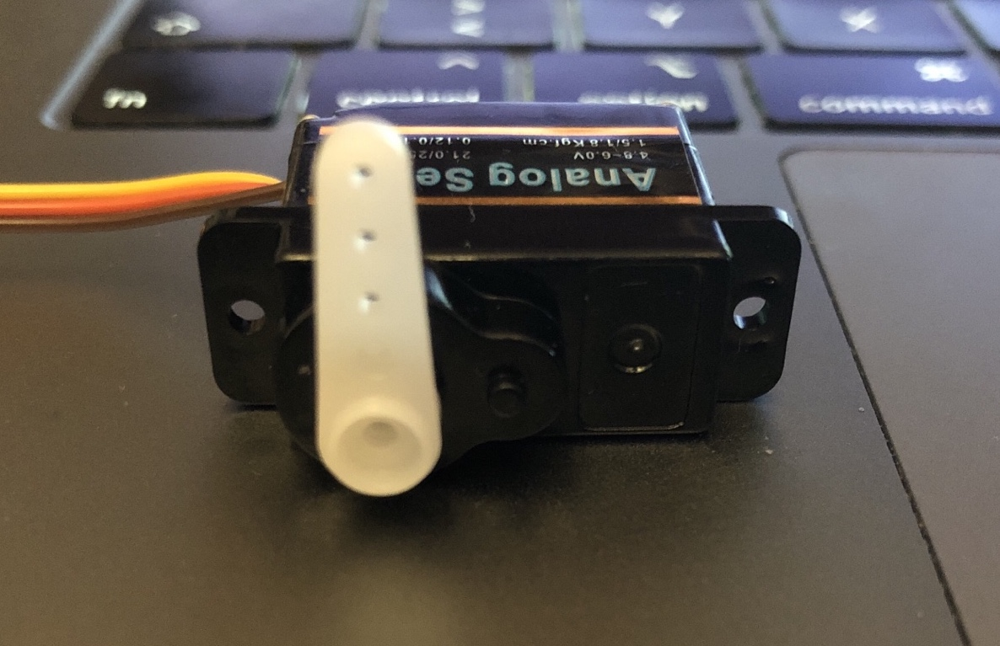
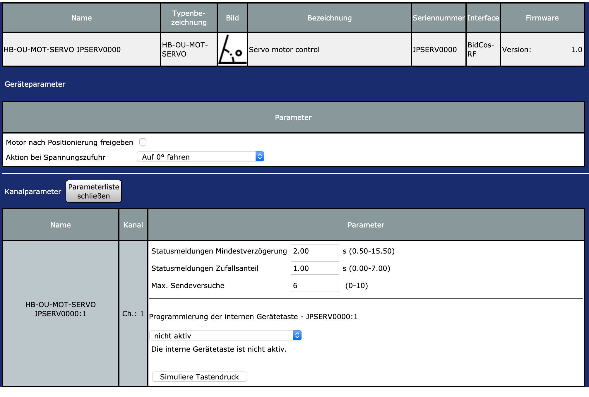

# HB-OU-MOT-SERVO
HomeMatic Servo Motor Controller
  Servo-Motor Steuerung mittels Arduino Pro Mini (8MHz / 3.3V) und AskSin++.

:information_source: Der Anschluss der Servo-Datenleitung erfolgt an Pin 3.

**:arrow_forward: Motor nach Positionierung freigeben**
- nachdem die Position angefahren wurde, wird der Motor freigegeben, so dass ein manuelles Verstellen der Mechanik möglich ist

**:arrow_forward: Aktion bei Spannungszufuhr**
- `Auf 0° fahren`
  - der Servo fährt auf die 0°-Position
- `In aktueller Position verweilen`  
  - der Servo wird nicht bewegt
  - :warning: in der WebUI ist nach Spannungszufuhr dennoch die Anzeige auf 0°!

  

**:arrow_forward: Bei Verwendung in einem Programm muss der prozentuale Anteil von 180° eingegeben werden.**
 _Beispiel: Sollen 135° angefahren werden, so sind 0.75 einzugeben_
